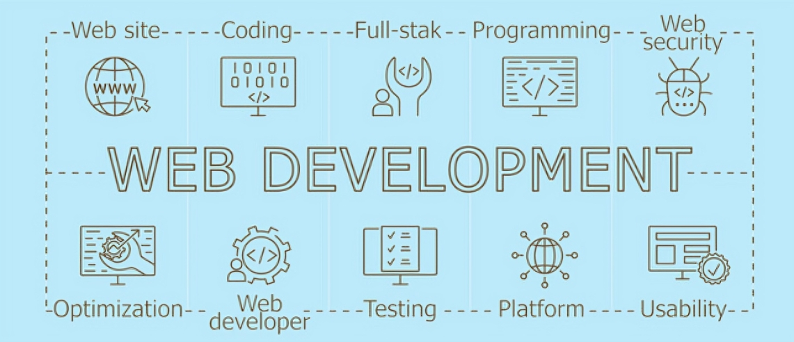

<h1 align="center">
  
</h1>

🔭 Currently Exploring: Building robust full-stack web applications with a strong emphasis on backend development using Node.js and cutting-edge web technologies.

🌱 Actively Learning: Mastering advanced JavaScript concepts, backend system design, and scalable full-stack development practices.

👯 Open to Collaborations: Excited to team up on open-source contributions, innovative web tools, and digital recreations of nostalgic Indian childhood games.

🤝 Seeking Guidance On: Performance optimization, scalable backend integrations, and architecting complex features efficiently.

💬 Let’s Talk Tech: Passionate about JavaScript, Node.js, Express, MongoDB, Tailwind CSS, Framer Motion, and crafting real-world web solutions.

&nbsp;<strong>How to reach me:</strong>&nbsp;

 
  &nbsp;
  

😄 **Pronouns**: He/Him

## 🛠️ Tech Stack

  

## 📊 GitHub Stats 

<!-- ## 🔗 Connect with Me

  
  
  

 -->

## ✨ Dev Quote

## 🐍 GitHub Contribution Snake

<picture>
  <source media="(prefers-color-scheme: dark)" srcset="https://raw.githubusercontent.com/SurajGupta2k/SurajGupta2k/output/github-snake-dark.svg" />
  <source media="(prefers-color-scheme: light)" srcset="https://raw.githubusercontent.com/SurajGupta2k/SurajGupta2k/output/github-snake.svg" />
  
</picture>
